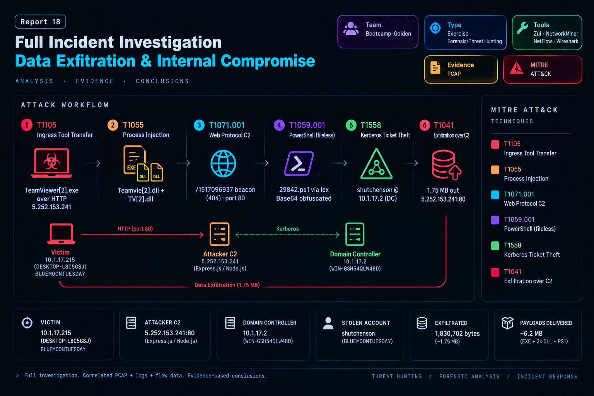
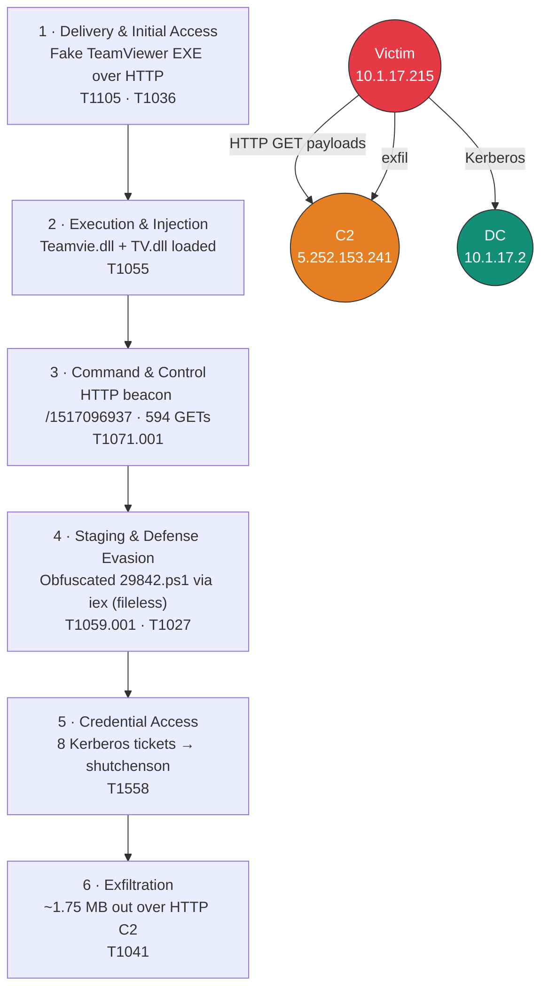

# Report 18 — Full Incident Investigation: Data Exfiltration & Internal Compromise




A full **incident-response lifecycle** investigation of a single packet capture
(`traffic_analysis.pcap`). One internal workstation was compromised by a **fake TeamViewer
trojan**, which established an HTTP command-and-control channel, ran a **fileless PowerShell
payload**, stole a domain credential via **Kerberos abuse**, and **exfiltrated data** back to the
attacker — all reconstructed and evidenced across five analysis phases.

> **This README is self-contained.** You can review the entire scenario, methodology, and findings
> here without opening the PDF report.

---

## TL;DR — What happened

On **2025-01-22**, workstation **`10.1.17.215`** (`DESKTOP-L8C5GSJ`, domain `BLUEMOONTUESDAY`)
downloaded a fake **TeamViewer** installer over **cleartext HTTP** from the attacker server
**`5.252.153.241`**. The malware pulled two companion DLLs, opened an HTTP **beacon C2** channel,
and executed an **obfuscated PowerShell script in memory** (via `iex`, leaving no disk artifact).
It then abused **Kerberos** against the domain controller **`10.1.17.2`** to steal the account
**`shutchenson`**, and **exfiltrated ~1.75 MB** back over the same HTTP channel. The whole chain
ran in roughly **53 minutes (19:45–20:38 UTC)**.

| | |
|---|---|
| **Victim** | `10.1.17.215` (DESKTOP-L8C5GSJ · BLUEMOONTUESDAY) |
| **Attacker C2** | `5.252.153.241:80` (Express.js / Node.js HTTP file server) |
| **Domain Controller** | `10.1.17.2` (WIN-GSH54QLW48D) |
| **Stolen account** | `shutchenson` (BLUEMOONTUESDAY) |
| **Exfiltrated** | 1,830,702 bytes (~1.75 MB) |
| **Payloads delivered** | ~6.2 MB (EXE + 2× DLL + PS1) |

---

## Repository structure

```
.
├── README.md                               ← you are here (full self-contained review)
├── Mohammed_Rida_Task18_Report.pdf         ← full technical report
├── screenshots/                            ← evidence figures (Zui queries, NetworkMiner, Wireshark)
└── KG/                                     ← Obsidian vault (nodes, links, colour config)
```

---

## The scenario (the task)

> An internal host is suspected of being **compromised**, **downloading malware**, and
> **exfiltrating sensitive data**. Investigate the PCAP end-to-end and answer:
> what was the initial infection vector, which host is compromised, what data was exfiltrated,
> were credentials stolen, and what is the attacker's infrastructure?

**Expected learning:** the full IR lifecycle, correlating **PCAP + logs + flow data**, a
threat-hunting mindset, and evidence-based conclusions.

### Lab environment
| Role | Component |
|---|---|
| Analyst machine | Kali Linux VM |
| Primary log analysis | **Zui (Brim)** — Zeek + Suricata |
| Forensic extraction | **NetworkMiner 3.1** |
| Flow analysis | **NetFlow** |
| Deep packet inspection | **Wireshark** |
| Evidence | `traffic_analysis.pcap` |

---

## Methodology — what we did, phase by phase

### Phase 1 — Detection (Suricata alert triage in Zui)
Surfaced high-severity events to find the initial indicator of compromise.

```text
event_type=="alert" | sort severity desc
event_type=="alert" alert.severity==1 | cut ts, src_ip, dest_ip, alert.signature
```

**Found:** 28 alerts, **4 severity-1 signatures** all part of one infection chain —
*ET MALWARE Fake MS Teams CnC Payload Request (GET)* ×2, *…VBS Payload Inbound*,
*ET POLICY TeamViewer Dyngate User-Agent*, and *ET POLICY PE EXE or DLL Windows file download
HTTP*. Key IPs `10.1.17.215` and `5.252.153.241` immediately stood out.

### Phase 2 — Behavioral analysis (Zeek logs in Zui)
Characterised the compromised host's behaviour: long sessions, downloads, DNS anomalies, big
transfers.

```text
_path=="conn" | sort duration desc                                   # longest sessions
_path=="conn" | sum(orig_bytes) by id.orig_h | sort sum desc         # top talkers
_path=="dns"  | count() by query | sort count asc                    # rare domains
_path=="http" id.orig_h==10.1.17.215 id.resp_h==5.252.153.241 \
              | cut ts, method, host, uri, status_code               # C2 URIs
_path=="conn" | count() by id.resp_p | sort count asc | head 20      # rare ports
```

**Found:**
- Longest session **43m12s**: `10.1.17.215:49689 → 5.252.153.241:80` (initial C2 + staging).
- **Top talker**: `10.1.17.215` = 1,830,702 bytes outbound (a massive outlier).
- Rare DNS: **`master16.teamviewer.com`** queried exactly once (C2 registration lure).
- **594 HTTP GETs** revealing two URI patterns (below).
- Rare ports: **88** (Kerberos, 25 conns) and **2917** (non-standard) flagged as suspicious.

**C2 URI patterns**

| URI | Status | Meaning |
|---|---|---|
| `/api/file/get-file/TeamViewer` | 200 | main trojan binary |
| `/api/file/get-file/29842.ps1` | 200 | PowerShell payload |
| `/api/file/get-file/264872` | 200 | additional binary |
| `/1517096937` | 404 | **beacon check-in** (session-ID polling; 404 = "stand by") |

### Phase 3 — Forensics (NetworkMiner)
Carved files, credentials, and host profiles from the PCAP.

**Found:**
- **Payloads extracted:** `TeamViewer[2].exe` (4.38 MB), `Teamvie[2].dll` (668 KB),
  `TV[2].dll` (12.9 KB) — all from `5.252.153.241`.
- **Victim profile:** `10.1.17.215` / `DESKTOP-L8C5GSJ` / `BLUEMOONTUESDAY` /
  MAC `00:D0:B7:26:4A:74` (Intel).
- **Credential theft:** **8 Kerberos records** `10.1.17.215 → 10.1.17.2`, account
  **`shutchenson`**, window **19:45:10–19:55:29 UTC**.

### Phase 4 — NetFlow analysis
Confirmed top talkers and quantified the transfer volumes at flow level.

**Found:** `10.1.17.215` is the **sole** dominant sender — **455× more** outbound than the next
host — confirming a single compromised host and pinpointing the exfiltration channel to
`5.252.153.241:80`.

### Phase 5 — Deep packet inspection (Wireshark)
Inspected the raw session and extracted the delivered payload.

```text
Display filter:  ip.addr == 10.1.17.215 && ip.addr == 5.252.153.241
Then:            right-click frame 5063 → Follow → HTTP Stream
```

**Found:**
- **Beacon cycling:** RST/ACK (frame 5035) → immediate new SYN (frame 5061) — connect, check-in,
  reset, repeat.
- **Payload:** `GET /api/file/get-file/29842.ps1` returns a **1,512-byte obfuscated PowerShell**
  script; response headers (`X-Powered-By: Express`) fingerprint the C2 as **Express.js / Node.js**.
- **Obfuscation:** character-noise `.replace()` chains rebuild `FromBase64String`, the real payload
  is Base64-encoded, and `iex (Invoke-Expression)` runs it **in memory** — fileless, no disk artifact.

---

## Attack chain



---

## Indicators of Compromise (IOCs)

| Type | Value |
|---|---|
| Victim host | `10.1.17.215` (DESKTOP-L8C5GSJ · BLUEMOONTUESDAY) |
| Victim MAC | `00:D0:B7:26:4A:74` (Intel Corporation) |
| Compromised account | `shutchenson` |
| Domain controller (targeted) | `10.1.17.2` (WIN-GSH54QLW48D) |
| **C2 server IP** | `5.252.153.241` |
| C2 MAC | `08:D0:9F:C2:3A:46` (Cisco Systems, Inc) |
| C2 protocol / port | HTTP / TCP 80 |
| C2 DNS lure | `master16.teamviewer.com` |
| C2 server tech | Express.js (Node.js) HTTP file server |
| Malware (EXE) | `TeamViewer[2].exe` (4.38 MB) |
| Malware (DLL) | `Teamvie[2].dll` (668 KB) · `TV[2].dll` (12.9 KB) |
| PowerShell payload | `29842.ps1` (1,512 bytes · Base64-obfuscated · fileless) |
| C2 beacon URI | `/1517096937` (404 = polling) |
| C2 payload URI | `/api/file/get-file/<id>` |
| Kerberos records | 8 (19:45–19:55 UTC) |
| Data exfiltrated | 1,830,702 bytes (~1.75 MB) |

---

## MITRE ATT&CK mapping

| Tactic | Technique | ID | Evidence |
|---|---|---|---|
| Command & Control | Ingress Tool Transfer | **T1105** | EXE + DLL + PS1 pulled over HTTP |
| Defense Evasion | Masquerading | **T1036** | fake TeamViewer brand + user-agent + DNS |
| Defense Evasion | Process Injection | **T1055** | `Teamvie[2].dll` + `TV[2].dll` |
| Command & Control | Application Layer Protocol: Web | **T1071.001** | HTTP/80 C2, 594 GETs |
| Execution | PowerShell | **T1059.001** | `29842.ps1` run via `iex` |
| Defense Evasion | Obfuscated Files or Information | **T1027** | Base64 + char-noise |
| Credential Access | Steal or Forge Kerberos Tickets | **T1558** | 8 Kerberos records |
| Exfiltration | Exfiltration Over C2 Channel | **T1041** | ~1.75 MB outbound |

---

## Lessons learned & countermeasures

- **Trusted brand names are a primary lure.** Any "TeamViewer" pulled from a non-vendor IP must be
  treated as hostile. → *T1036*
- **Plain HTTP on port 80 is still a viable C2 channel.** Application-aware egress filtering and
  TLS enforcement would have blocked the cleartext PE download. → *T1105 / T1071.001*
- **Baseline Kerberos per workstation.** A spike of ticket requests from one host to the DC is a
  high-value credential-theft signal. → *T1558*
- **Constrain & log PowerShell.** Script-block logging + AMSI + Constrained Language Mode would
  surface the `iex` fileless execution. → *T1059.001 / T1027*
- **Alert on egress-volume outliers.** A single host sending 455× the next talker is an unambiguous
  exfiltration indicator. → *T1041*
- **Multi-tool correlation is essential.** No single tool told the whole story — Suricata flagged
  the signatures, Zeek quantified sessions and top talkers, NetworkMiner carved the binaries and
  credentials, NetFlow confirmed the exfil, and Wireshark proved the payload.

---

## Author

**Mohammed Rida Lakhdari** — Purple Team Bootcamp (Golden track)
Supervisors: Mohammed Baqer Hasan · Anmar Mohammed
Scenario ID: `16-lec-33-brim&zui-14-golden` · Delivered 2026-05-02
